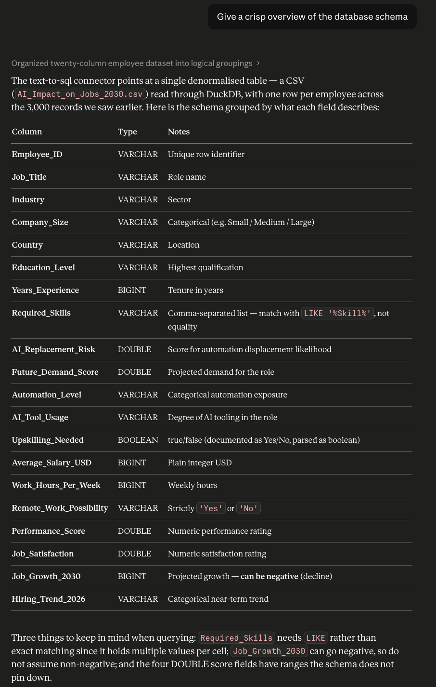
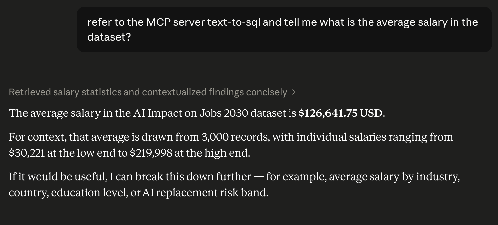
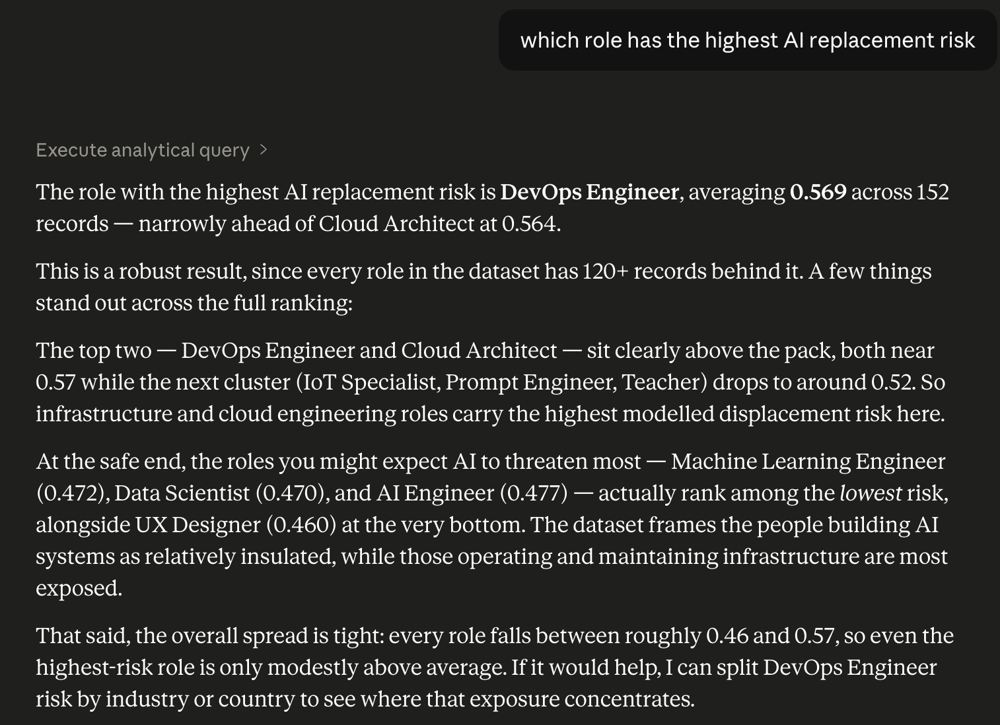

# MCP Server: Text to SQL

An MCP (Model Context Protocol) server that enables LLMs to query the **AI Impact on Jobs 2030** dataset using natural language, translated to SQL via DuckDB.

## Features

- **Dynamic Schema Injection** — The database schema is extracted at server startup and embedded into the tool description, so the LLM always has full context to write accurate SQL.
- **MCP Resources** — Exposes the database schema and a business glossary as MCP resources for clients that support them.
- **Read-Only Safety** — Only `SELECT` queries are permitted.

## Project Structure

```
mcp-server-text-to-sql/
├── data/
│   └── AI_Impact_on_Jobs_2030.csv
├── src/
│   └── mcp_server.py
├── requirements.txt
├── .gitignore
└── README.md
```

## Setup

### Prerequisites

- Python 3.10+

### Installation

```bash
pip install -r requirements.txt
```

### Running the Server

```bash
python src/mcp_server.py
```

The server starts using the default **stdio** transport.

## Testing

### MCP Inspector

Use the built-in MCP Inspector to verify that tools and resources are working correctly:

```bash
mcp dev src/mcp_server.py
```

This opens a web UI (typically at `http://localhost:5173`) where you can:

- **Tools tab** — View the `execute_analytical_query` tool, its full description (with schema), and test it by entering SQL queries directly.
- **Resources tab** — Read `resource://database/schema` and `resource://business/glossary` to verify their output.

> **Note:** The MCP Inspector tests the server's mechanics only. It does not have an LLM in the loop, so natural language queries are not supported here.

## Usage with LLM Clients

To test the full natural language → SQL experience, connect this server to an MCP-compatible LLM client.

### Claude Desktop

Add the following to your `claude_desktop_config.json`:

```json
{
  "mcpServers": {
    "text-to-sql": {
      "command": "python",
      "args": ["src/mcp_server.py"],
      "cwd": "/path/to/mcp-server-text-to-sql"
    }
  }
}
```

Restart Claude Desktop, then ask natural language questions like:
- *"What are the top 5 highest paying jobs?"*
- *"Which industries have the highest AI replacement risk?"*

### Cursor

Go to **Cursor Settings → MCP** and add the server with the same command and args as above.


## Claude Desktop in Action

The screenshots below show real interactions with the server connected to Claude Desktop as an MCP client. The model converts each natural language prompt into a SQL query, executes it through the `execute_analytical_query` tool, and summarizes the result.

### Schema discovery
Claude reads the `resource://database/schema` resource and presents a column-by-column overview on demand.



### Aggregate query
A single-sentence prompt — *"what is the average salary in the dataset?"* — is answered with the computed aggregate and surrounding context (record count, salary range).



### Ranking / analytical query
A comparative question — *"which role has the highest AI replacement risk?"* — returns the top role with the underlying score, sample size, and a short comparison against neighbouring roles.




## Data Attribution

The dataset `AI_Impact_on_Jobs_2030.csv` located in the `data/` folder is sourced from Kaggle.

- **Dataset:** [AI Impact in Future on Jobs Market in 2030](https://www.kaggle.com/datasets/muhammadwaqas023/ai-impact-in-future-on-jobs-market-in-2030/data)
- **Author:** Muhammad Waqas

We would like to thank the author for providing this dataset.
